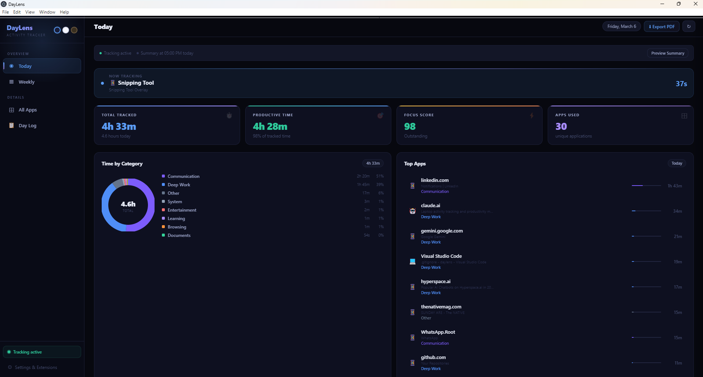
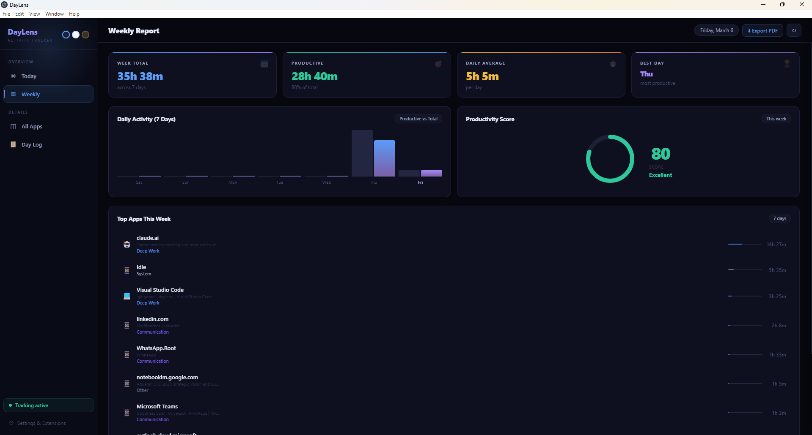
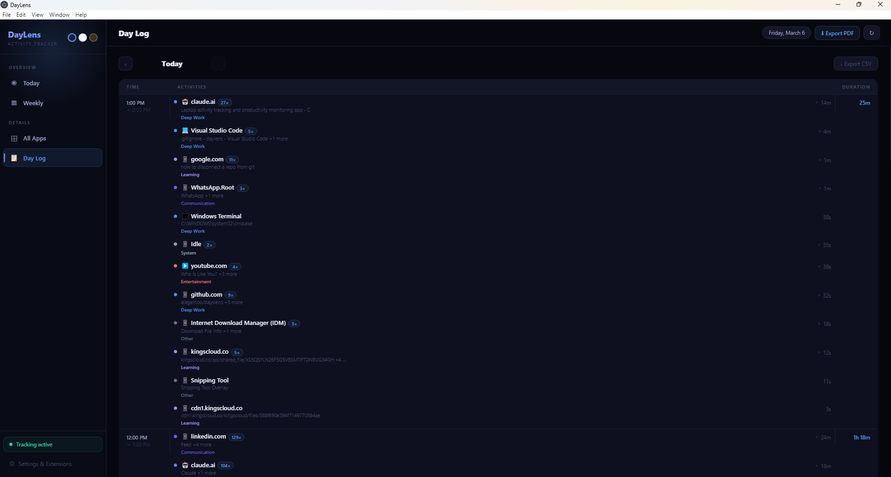
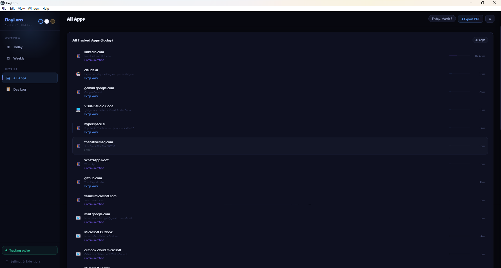

# DayLens — Know Where Your Day Actually Goes

> An automatic, local-first activity tracker for Windows that shows you exactly how you spend your time — with zero manual input.


---

## What is DayLens?

Most people think they work 8 focused hours a day. DayLens shows the truth.

DayLens runs quietly in the background and automatically logs every app you use, every website you visit, and every browser tab you switch to. At the end of the day, you get a clear breakdown: how much was Deep Work, how much was Communication, how much was Entertainment — and a Focus Score that doesn't lie.

Everything stays **100% on your device**. No cloud. No account. No subscription.

---

## Features

### 🎯 Automatic Tracking
- Detects your active window every 6 seconds — no manual timers
- Tracks browser tabs individually via a Chrome/Brave extension
- Knows when you're idle, asleep, or have locked your screen — stops counting
- Closes sessions cleanly at midnight so one day never bleeds into the next

### 🧠 Smart Categorization
- Every app and website is sorted into: **Deep Work, Learning, Communication, Documents, Browsing, Entertainment, Social Media, System**
- Context-aware — the same app can mean different things:
  - YouTube + tutorial title → **Learning**
  - YouTube + vlog title → **Entertainment**
  - YouTube Shorts → **Entertainment**
- AI tools automatically classified as Deep Work: `claude.ai`, `chatgpt.com`, `gemini.google.com`, `perplexity.ai`, `cursor.sh`, and more
- PDF files, document viewers, and idle time all correctly handled

### 📊 Today Dashboard
- Total tracked time, productive time, Focus Score (0–100), apps used
- Live "Now Tracking" bar with a running timer
- Donut chart breaking down time by category
- Top Apps list with category labels and usage bars
- Hour-by-hour timeline of your full day

### 📅 Weekly Report
- 7-day bar chart comparing total vs productive time
- Weekly Focus Score with ring visualization
- Best day, daily average, and week total stats
- Top apps across the full week

### 📋 Day Log
- Browse any past day hour by hour
- Activities grouped by app, expandable to see individual page/window visits
- Navigate backwards through any previous day
- Export any day as a CSV file

### 📄 PDF Export
- Export today's report or the weekly report as a polished PDF
- Includes AI-style contextual insights: peak hour, deep work %, distraction patterns
- Full app breakdown with category and time

### 🔔 Daily Summary Notification
- Notification at 5:00 PM with your focus score, top apps, and a daily verdict
- Preview the summary at any time from the dashboard

### 🎨 Themes
- Dark, Light, and Sepia themes — instant switching, remembered across sessions

---

## Screenshots

| Today Dashboard | Weekly Report |
|---|---|
| ** | ** |

| Day Log | All Apps |
|---|---|
| ** | ** |

---

## Installation

### Requirements
- Windows 10 or Windows 11 (64-bit)
- Node.js 18+ (for running from source)
- Chrome or Brave browser (for browser tab tracking)

### Option A — Run from Source

```bash
# 1. Clone the repo
git clone https://github.com/alagemoo/dayslens.git
cd dayslens

# 2. Install dependencies
npm install

# 3. Start the app
npm start
```

### Option B — Build an Installer

```bash
npm run build
```

This creates a Windows installer (`DayLens-Setup.exe`) and a portable version inside the `dist/` folder.

---

## Browser Extension Setup

The browser extension enables per-tab tracking inside Chrome and Brave. Without it, the app only knows "Chrome is open" — with it, it knows exactly which site you're on and for how long.

**Install the extension:**

1. Open Chrome or Brave and go to `chrome://extensions`
2. Enable **Developer Mode** (toggle in the top right)
3. Click **Load unpacked**
4. Select the `assets/extension/` folder from this repo
5. The DayLens icon will appear in your toolbar — it turns green when connected

**How it works:**
- The extension tracks only the **active tab in the focused window**
- When you switch to another app, the browser tab stops counting immediately
- Tab switches, navigation, and title changes are all tracked
- A keepalive heartbeat runs every 25 seconds to keep the connection alive — this does **not** create duplicate entries

---

## How Categorization Works

DayLens uses a three-layer system to categorize every activity:

1. **User overrides** — if you've manually set a category for an app, that always wins
2. **Domain + title rules** — smart per-site logic (e.g. YouTube checks the video title)
3. **App name fallback** — pattern matching on the application name

### Context-aware examples

| Site | Title Signal | Category |
|---|---|---|
| youtube.com | "Python Tutorial for Beginners" | Learning |
| youtube.com | "Day in my life vlog" | Entertainment |
| youtube.com | "#Shorts" | Entertainment |
| reddit.com | "/r/learnprogramming" | Learning |
| reddit.com | "/r/funny" | Social Media |
| spotify.com | "Machine Learning podcast" | Learning |
| spotify.com | Any music | Entertainment |

### AI tools → always Deep Work
`claude.ai` · `chatgpt.com` · `gemini.google.com` · `perplexity.ai` · `cursor.sh` · `v0.dev` · `replit.com` · `huggingface.co` · `phind.com` · `copilot.microsoft.com`

---

## Data & Privacy

- **All data is stored locally** in a SQLite database at `%APPDATA%/daylens/daylens.db`
- No data is ever sent to any server
- No account required
- No telemetry of any kind
- You can delete your data at any time by deleting the `.db` file

---

## Project Structure

```
daylens/
├── src/
│   ├── main.js          # Electron main process — tracking, DB, IPC
│   ├── preload.js       # Bridge between main and renderer
│   └── renderer/
│       └── index.html   # Full UI — dashboard, charts, day log
├── assets/
│   ├── extension/       # Chrome/Brave browser extension
│   │   ├── background.js
│   │   ├── manifest.json
│   │   └── popup.html
│   ├── icon.ico
│   └── icon.png
├── package.json
└── README.md
```

---

## Tech Stack

| Layer | Technology |
|---|---|
| Desktop shell | Electron 29 |
| Database | sql.js (SQLite, in-memory + file persistence) |
| Window detection | PowerShell (Windows API) |
| Browser tracking | Chrome Extension (Manifest V3) |
| Communication | WebSocket (ws://127.0.0.1:43821) |
| UI | Vanilla HTML/CSS/JS — no framework |
| Build | electron-builder |

---

## Development

```bash
# Run in development mode
npm start

# The app uses a file watcher — edit index.html and reload the window (Ctrl+R)
# Main process changes require restarting npm start
```

**Key files to know:**
- `src/main.js` — all tracking logic, DB queries, IPC handlers, WebSocket server
- `src/renderer/index.html` — entire frontend in one file
- `assets/extension/background.js` — browser extension service worker

---

## Roadmap

- [ ] Daily goals & alerts (e.g. max 1h LinkedIn, min 4h Deep Work)
- [ ] Honest Focus Score that penalizes Social Media
- [ ] Historical trends beyond 7 days
- [ ] macOS support
- [ ] Auto-update mechanism
- [ ] Pomodoro / Focus Mode timer

---

## Contributing

Pull requests are welcome. For major changes, please open an issue first to discuss what you'd like to change.

1. Fork the repo
2. Create a branch: `git checkout -b feature/your-feature`
3. Commit your changes: `git commit -m "Add your feature"`
4. Push: `git push origin feature/your-feature`
5. Open a Pull Request

---

## License

MIT — see [LICENSE](LICENSE) for details.

---

## Author

Built by **Gideon Aniechi**  
GitHub: [@alagemoo](https://github.com/alagemoo)

---

*DayLens — because what gets measured, gets managed.*