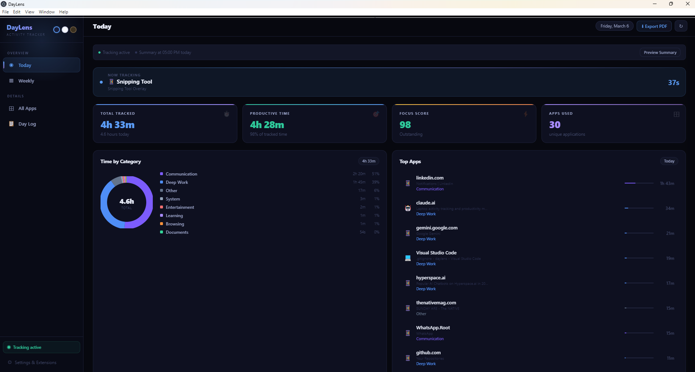
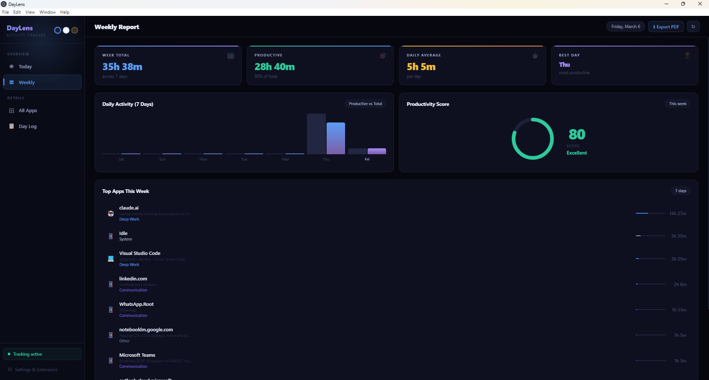
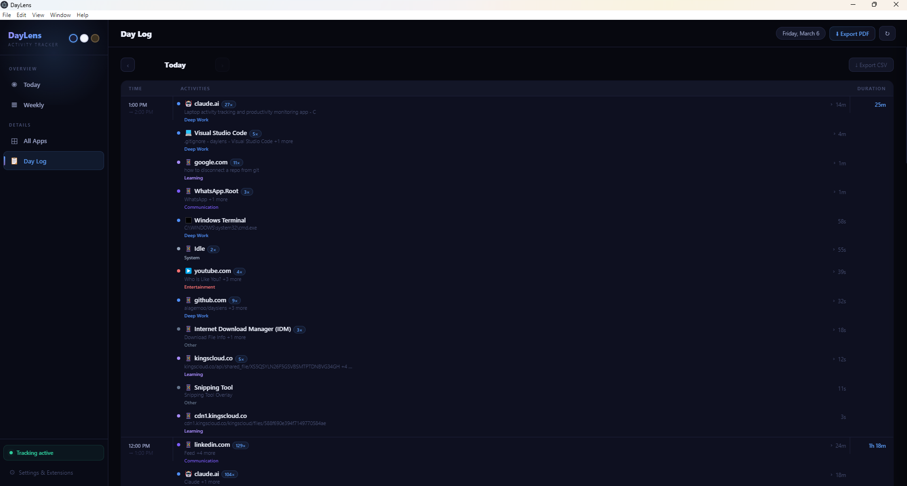
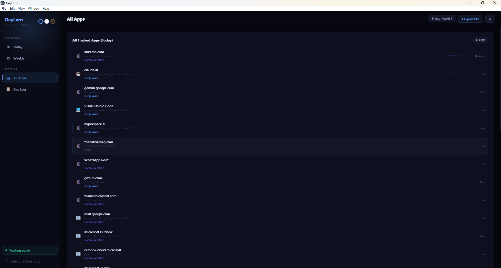

# DayLens — Know Where Your Day Actually Goes

> An automatic, local-first activity tracker for Windows that shows you exactly how you spend your time — with zero manual input.


---

## What is DayLens?

Most people think they work 8 focused hours a day. DayLens shows the truth.

DayLens runs quietly in the background and automatically logs every app you use, every website you visit, and every browser tab you switch to. At the end of the day, you get a clear breakdown: how much was Deep Work, how much was Communication, how much was Entertainment — and a Focus Score that doesn't lie.

Everything stays **100% on your device**. No cloud. No account. No subscription.

---

## Features

### 🔍 Automatic Tracking
- Records every app you use, every 6 seconds, completely silently
- Detects when you're idle, when the screen locks, or when the laptop sleeps — and stops counting
- Survives battery death and crashes without creating phantom data
- Smart detection of Windows system processes (never logs lock screen or idle time as activity)

### 🌐 Browser Extension (Per-Tab Tracking)
- Companion extension for Chrome, Brave, and Edge
- Tracks exactly which websites and tabs you're on, not just "browser is open"
- SPA-aware — catches navigation on GitHub, Notion, and other single-page apps
- Reconnects automatically if the browser restarts

### 🗂 Smart Categorization
- Automatically categorizes apps into: **Deep Work, Learning, Communication, Documents, Browsing, Entertainment, Social Media, System, Other**
- Context-aware rules: YouTube music vs YouTube tutorials get different categories; Reddit programming vs Reddit entertainment differ too
- Recognizes 50+ apps out of the box including Microsoft Office, Adobe suite, Zoom, Slack, VS Code, and more
- **Right-click any app to manually set its category** — saved permanently, never overwritten by auto-detection

### 📊 Dashboard Views
- **Today** — live productivity score, time by category (donut chart), top apps, and a full-day timeline
- **Weekly** — 7-day bar chart, week total, best day, and focus trend
- **All Apps** — complete list of everything tracked, sorted by time
- **Day Log** — hour-by-hour breakdown of your entire day with drill-down per app

### 📄 PDF Export
- Export any day or week as a polished PDF report
- Includes: stats summary, category breakdown, top apps, hourly chart, and AI-generated insights about your day
- Dark-themed, print-ready

### 🔔 Daily Summary Notification
- Desktop notification at 5:00 PM every day with your productivity score and top apps
- Trigger a preview any time from the app

### 🔒 100% Private
- All data is stored in a local SQLite database on your machine
- No accounts, no internet connection required, no telemetry

### 🎨 Themes
- Dark, Light, and Sepia themes — instant switching, remembered across sessions

---

## Screenshots

| Today Dashboard | Weekly Report |
|---|---|
| ** | ** |

| Day Log | All Apps |
|---|---|
| ** | *gi* |

---

## Quick Start

### Windows

1. Open **Command Prompt** — press `Win + R`, type `cmd`, press Enter
2. Navigate to this folder:
   ```
   cd path\to\daylens
   ```
3. Run setup (only needed once):
   ```
   setup.bat
   ```
4. Launch the app:
   ```
   npm start
   ```

### macOS

1. Open **Terminal**
2. Navigate to this folder:
   ```
   cd /path/to/daylens
   ```
3. Run setup (only needed once):
   ```
   chmod +x setup.sh && ./setup.sh
   ```
4. Launch:
   ```
   npm start
   ```

---

## Installation

### Requirements
- Windows 10 or Windows 11 (64-bit)
- Node.js 18+ (for running from source)
- Chrome or Brave browser (for browser tab tracking)

### Option A — Run from Source

```bash
# 1. Clone the repo
git clone https://github.com/alagemoo/dayslens.git
cd dayslens

# 2. Install dependencies
npm install

# 3. Start the app
npm start
```

### Option B — Build an Installer

```bash
npm run build
```

This creates a Windows installer (`DayLens-Setup.exe`) and a portable version inside the `dist/` folder.

---

## Browser Extension Setup

The browser extension enables per-tab tracking inside Chrome and Brave. Without it, the app only knows "Chrome is open" — with it, it knows exactly which site you're on and for how long.

**Install the extension:**

1. Open Chrome or Brave and go to `chrome://extensions`
2. Enable **Developer Mode** (toggle in the top right)
3. Click **Load unpacked**
4. Select the `assets/extension/` folder from this repo
5. The DayLens icon will appear in your toolbar — it turns green when connected

**How it works:**
- The extension tracks only the **active tab in the focused window**
- When you switch to another app, the browser tab stops counting immediately
- Tab switches, navigation, and title changes are all tracked
- A keepalive heartbeat runs every 25 seconds to keep the connection alive — this does **not** create duplicate entries

---

## Using the Day Log

The Day Log shows your full day hour by hour. Each hour block lists every app used, with visit counts and durations.

- **Click** an app row to expand individual visits with timestamps
- **Right-click** any app to change its category — saved permanently
- **Export CSV** for spreadsheet analysis
- **Export PDF** for a shareable daily report
- Use the **← →** arrows to navigate to previous days

---

## How Categorization Works

DayLens uses a three-layer system to categorize every activity:

1. **User overrides** — if you've manually set a category for an app, that always wins
2. **Domain + title rules** — smart per-site logic (e.g. YouTube checks the video title)
3. **App name fallback** — pattern matching on the application name

### Context-aware examples

| Site | Title Signal | Category |
|---|---|---|
| youtube.com | "Python Tutorial for Beginners" | Learning |
| youtube.com | "Day in my life vlog" | Entertainment |
| youtube.com | "#Shorts" | Entertainment |
| reddit.com | "/r/learnprogramming" | Learning |
| reddit.com | "/r/funny" | Social Media |
| spotify.com | "Machine Learning podcast" | Learning |
| spotify.com | Any music | Entertainment |

### AI tools → always Deep Work
`claude.ai` · `chatgpt.com` · `gemini.google.com` · `perplexity.ai` · `cursor.sh` · `v0.dev` · `replit.com` · `huggingface.co` · `phind.com` · `copilot.microsoft.com`

---

## Data & Privacy

- **All data is stored locally** in a SQLite database at `%APPDATA%/daylens/daylens.db`
- No data is ever sent to any server
- No account required
- No telemetry of any kind
- You can delete your data at any time by deleting the `.db` file

---

## Project Structure

```
daylens/
├── src/
│   ├── main.js          # Electron main process — tracking, DB, IPC
│   ├── preload.js       # Bridge between main and renderer
│   └── renderer/
│       └── index.html   # Full UI — dashboard, charts, day log
├── assets/
│   ├── extension/       # Chrome/Brave browser extension
│   │   ├── background.js
│   │   ├── manifest.json
│   │   └── popup.html
│   ├── icon.ico
│   └── icon.png
├── package.json
└── README.md
```

---

## Tech Stack

| Layer | Technology |
|---|---|
| Desktop shell | Electron 29 |
| Database | sql.js (SQLite, in-memory + file persistence) |
| Window detection | PowerShell (Windows API) |
| Browser tracking | Chrome Extension (Manifest V3) |
| Communication | WebSocket (ws://127.0.0.1:43821) |
| UI | Vanilla HTML/CSS/JS — no framework |
| Build | electron-builder |

---

## Development

```bash
# Run in development mode
npm start

# The app uses a file watcher — edit index.html and reload the window (Ctrl+R)
# Main process changes require restarting npm start
```

**Key files to know:**
- `src/main.js` — all tracking logic, DB queries, IPC handlers, WebSocket server
- `src/renderer/index.html` — entire frontend in one file
- `assets/extension/background.js` — browser extension service worker

---

## Roadmap

- [x] App tracking + SQLite storage
- [x] Dashboard: Today, Weekly, All Apps, Day Log views
- [x] Smart automatic categorization (50+ apps)
- [x] Manual category override with permanent memory
- [x] Productivity score + Focus Score
- [x] Day timeline visualization
- [x] Browser extension — per-tab tracking
- [x] PDF export with AI-generated insights
- [x] Daily summary notification
- [x] Background audio tracking (webinars, music)
- [x] Crash / battery-death recovery — no phantom data
- [x] Idle / lock screen detection
- [ ] Goals & daily time limits per category
- [ ] App icons / favicons
- [ ] Historical trends beyond 7 days
- [ ] Auto-start on login

---

## Contributing

Pull requests are welcome. For major changes, please open an issue first to discuss what you'd like to change.

1. Fork the repo
2. Create a branch: `git checkout -b feature/your-feature`
3. Commit your changes: `git commit -m "Add your feature"`
4. Push: `git push origin feature/your-feature`
5. Open a Pull Request

---

## License

MIT — see [LICENSE](LICENSE) for details.

---

## Author

Built by **Gideon Aniechi** with all the love in the world.  
GitHub: [@alagemoo](https://github.com/alagemoo)

---

*DayLens — because what gets measured, gets managed.*